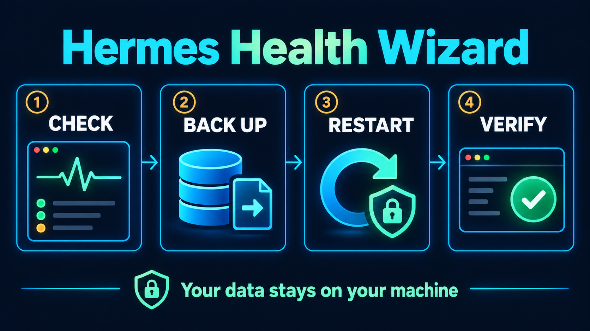

<p align="center"></p>

# ویزارد سلامت هرمس

<p align="center">تشخیص محلی و بازیابی کنترل‌شده برای Hermes Agent و Hermes WebUI</p>

<p align="center">
  <a href="https://github.com/ketabchi-ar/hermes-health-wizard/actions/workflows/ci.yml"></a>
  
  
  
  
</p>

[English](README.md) · **فارسی**


این ابزار با پایتون ۳٫۱۰ یا جدیدتر و بدون وابستگی اضافی، وضعیت Hermes Agent و Hermes WebUI را بررسی می‌کند. پنل فقط روی `127.0.0.1` باز می‌شود. این پروژه مستقل است و وابسته به NousResearch یا نگه‌داران Hermes WebUI نیست.

## اجرا

```bash
git clone https://github.com/ketabchi-ar/hermes-health-wizard.git
cd hermes-health-wizard
./run.sh
```

نشانی خصوصی پنل در ترمینال چاپ می‌شود و مرورگر باز خواهد شد. ترمینال را تا پایان کار باز نگه دارید. اگر مسیر نصب یا پورت شما متفاوت است:

```bash
./run.sh --hermes-home /path/to/.hermes --webui-repo /path/to/hermes-webui --port 8787 panel
```

فرمان‌های ترمینال:

```bash
./run.sh doctor             # گزارش بدون تغییر در داده‌ها
./run.sh doctor --json      # گزارش ساختاریافته
./run.sh logs errors        # ۱۰۰ خط آخر خطاها با پوشاندن الگوهای رایج رمز
./run.sh backup             # پشتیبان سازگار از دیتابیس
./run.sh restart-webui      # تأیید تعاملی و بازراه‌اندازی کنترل‌شده
```

## پوستر راهنمای بازیابی



## هنگام هنگ کردن

۱. `./run.sh` را اجرا کنید و گزارش را ببینید. زنده بودن پورت به‌تنهایی نشانهٔ سالم بودن WebUI نیست؛ بررسی عمیق و فهرست نشست‌ها هم باید پاسخ بدهند.

۲. دکمهٔ «پشتیبان‌گیری از دیتابیس» را بزنید. پشتیبان در `~/.hermes/backups/hermes-health-wizard/` ساخته و از نظر سلامت بررسی می‌شود. دیتابیس اصلی حذف یا بازنویسی نمی‌شود.

۳. اگر WebUI با `ctl.sh` اجرا شده است، دکمهٔ «راه‌اندازی دوباره» را بزنید. ابزار مالکیت پردازه را کنترل می‌کند و پس از راه‌اندازی، سلامت سرویس را دوباره می‌سنجد.

۴. پس از بازراه‌اندازی، نتیجهٔ بررسی عمیق سلامت را ببینید و گزارش را تازه کنید تا پاسخ فهرست نشست‌ها هم مشخص شود. اگر پردازه در یک ترمینال جداگانه اجرا شده باشد، پنل PID آن را نشان می‌دهد و برای جلوگیری از توقف برنامهٔ اشتباه، آن را خودکار قطع نمی‌کند. در ترمینال اصلی `Ctrl+C` بزنید. اگر پاسخ نداد، PID را بررسی کنید، ابتدا `TERM` و فقط در صورت بی‌اثر بودن آن `KILL` بفرستید؛ سپس یک نسخهٔ تحت مدیریت `ctl.sh` راه بیندازید.

برای کاهش تکرار مشکل، فقط یک نمونهٔ WebUI را روی یک پوشهٔ داده اجرا کنید، بررسی عمیق سلامت را پایش کنید و هشدارهای `database is locked` و `live SessionDB handles` را جدی بگیرید. لاگ‌ها می‌توانند سرنخ باشند اما به‌تنهایی علت قطعی را ثابت نمی‌کنند. فایل‌های `state.db`، `state.db-wal`، `state.db-shm` یا نشست‌ها را برای رفع هنگ حذف نکنید.

گزارش دانلودشده ممکن است مسیر فایل‌ها یا متن خصوصی خطاها را داشته باشد؛ پیش از فرستادن برای دیگران آن را بازبینی کنید.

## فرمان‌ها و محدودیت‌ها

```bash
./run.sh doctor             # گزارش بدون تغییر در داده‌ها
./run.sh doctor --json      # گزارش ساختاریافته
./run.sh logs errors        # ۱۰۰ خط آخر خطاها
./run.sh backup             # پشتیبان سازگار از SQLite
./run.sh restart-webui      # تأیید تعاملی
./run.sh panel --no-browser # فقط چاپ نشانی پنل
```

ابزار پردازهٔ نامشخص را خودکار نمی‌کشد و باگ درونی Hermes را تعمیر نمی‌کند. اگر پشتیبان‌گیری شکست بخورد، بازراه‌اندازی انجام نمی‌شود. هشدارهای دو ساعت گذشته ممکن است پس از بهبود سرویس هم وضعیت را موقتاً «نیازمند بررسی» نشان دهند. مجوز پروژه [MIT](LICENSE) است.

برای اطلاعات بیشتر، [مستندات نشست‌های Hermes](https://github.com/NousResearch/hermes-agent/blob/main/website/docs/developer-guide/session-storage.md)، [راهنمای مدیریت سرویس WebUI](https://github.com/nesquena/hermes-webui/blob/master/docs/supervisor.md) و [راهنمای عیب‌یابی WebUI](https://github.com/nesquena/hermes-webui/blob/master/docs/troubleshooting.md) را ببینید.
